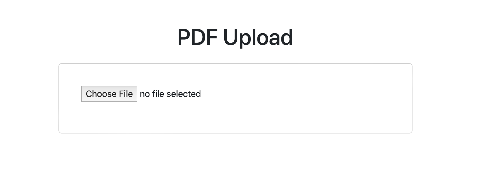
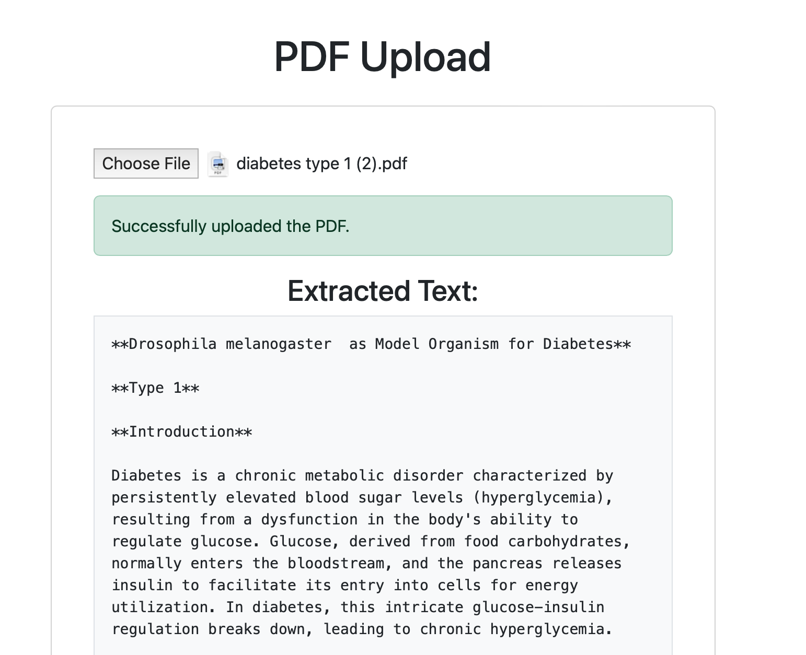

# pdf2md

It convert pdf document to markdown. The pdf should be searchable. Currently the service does not support OCR.  
The service remove the texts inside the bounded tables. So the output text is consistent. 

## Demo

### Start Page

### Ouput

## Installation

### Docker
Clone the github repo. Then run docker compose.

`docker compose up`

The service will run on port 8080.

